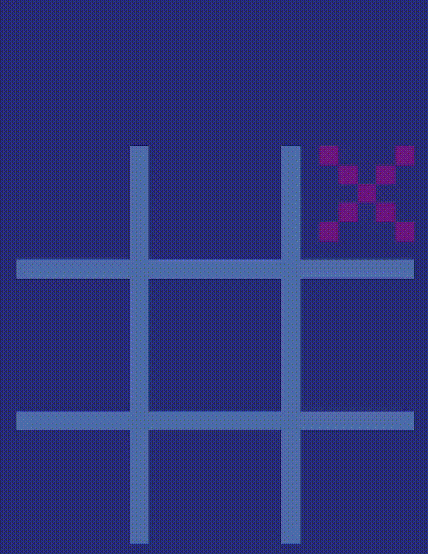

<p align="center">
	<h1 align="center">Tic Tac Go!</h2>
	<p align="center">A simple Tic Tac Toe game written in Go using SDL2</p>
</p>
<p align="center">
	<a href="./LICENSE">
		
	</a>
	<a href="https://github.com/LordOfTrident/tic-tac-go/issues">
		
	</a>
	<a href="https://github.com/LordOfTrident/tic-tac-go/pulls">
		
	</a>
	<br><br><br>
	
</p>

## Table of contents
* [Introduction](#introduction)
* [Quickstart](#quickstart)
* [Controls](#controls)
* [Bugs](#bugs)
* [Dependencies](#dependencies)
* [Make](#make)

## Introduction
I just started learning Go, so to get more familiar with it i wrote my first game in it - Tic Tac Go

## Quickstart
```sh
$ make
$ ./bin/app
```

## Controls
| Key              | Action                                          |
| ---------------- | ----------------------------------------------- |
| Left Mouse Click | Place X or O/restart game when the game is over |
| ESC              | Quit                                            |

## Bugs
If you find any bugs, please create an issue and report them.

## Dependencies
- [SDL2 for Go](https://github.com/veandco/go-sdl2)

## Make
Run `make all` to see all the make rules.
